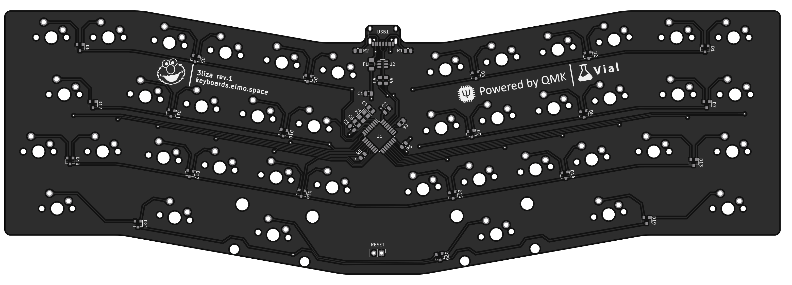
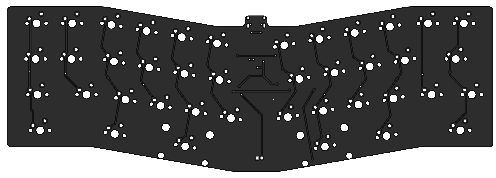

# 3liza PCB

### Features

- Powered by an Atmega32u2
- Basic ESD and overvoltage protection
- Centered USB type-C port for a detachable cable
- Fully programmable using [QMK](https://qmk.fm) and [Vial](https://get.vial.today)

---

### Supported layouts

---

### Preview

